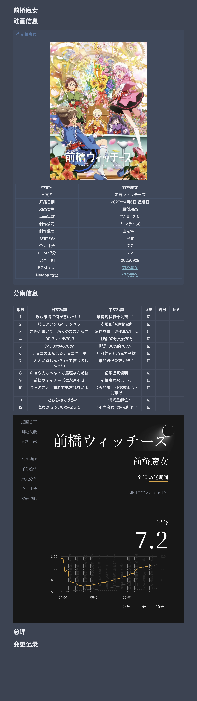

# Bangumi-to-obsidian-lite
> 一个 Obsidian 自建本地动画库方案（轻量化版）。v1.0 版
 

---
## 项目简介
**Bangumi-to-obsidian-lite** 是一套包含记录与管理动画的完整解决方案，利用 Templater+QuickAdd+Dataview 插件，轻松实现：
- 信息抓取：从 `https://bgm.tv` 抓取动画基础信息与分集信息
- 信息记录：生成 Obsidian 笔记（包含 `# 动画信息`、`# 分集信息`、`# 总评`、`# 变更记录`）
- 信息管理：追番表格自动统计所有记录的动画，并按季度分类

作者 B 站主页：[北漠海](https://space.bilibili.com/1065768987)

本项目由[月涟_luvian](https://space.bilibili.com/67571043) 的项目 [Bangumi-to-obsidian](https://github.com/luvian114/Bangumi-to-obsidian) 改版而来，征得原作者同意而发布，欢迎前往支持原作者！在此对 @月涟_luvian 的支持表示感谢！

如果对本改版项目有任何建议，或者如果发现 bug，请 B 站私信[北漠海](https://space.bilibili.com/1065768987)或加 QQ 群 588526922 反馈。

---
## 配置方法
1. 将脚本文件 `ACGbangumi.js` 移动到仓库中任意路径，`追番表格` 也可以放在任意路径；
    
2. 在 Obsidian 安装并启用插件：**Templater+QuickAdd+Dataview**，并启用 Dataviewjs；
    
3. 在 QuickAdd 中添加一个新的 Macro：
    
    - 名称自定，没有要求；
        
    - **User Script** 选择 `ACGbangumi.js` ；
        
    - 保存即可；
        
4. 运行流程：
    
    - 运行 Macro 后会弹出输入 `作品名称` → 选择搜索结果 → 填写评分 / 观看状态 / 分类 → 脚本将创建或更新对应笔记。

---
## 输出笔记示例

---
## 更新日志
v1.0 版：2025 年 9 月 19 日发布
## To-do:
1. 优化分集评分和分集短评的记录和展示方式（但我目前没有思路，欢迎交流）；
2. 增加追番表格的分类方式，增加可视化表格；
3. **终极目标**：将该项目写成 Obsidian 插件发布。

## 开源协议
_世界因开源更精彩_
